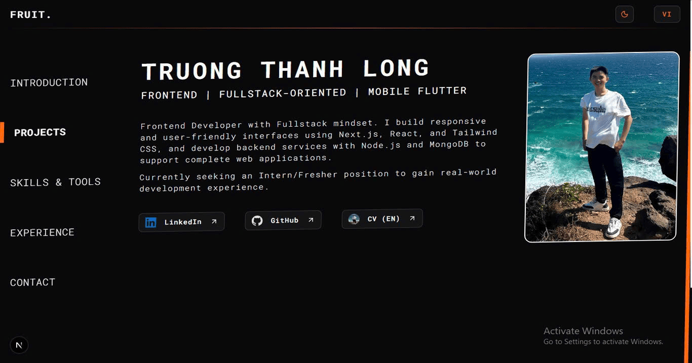

<h1 align="center">Welcome to portfolio 👋</h1>

  
  
  
  

> A personal portfolio built with Next.js, Shadcn UI, and next-intl, showcasing my hands-on projects and technical skills as a Frontend Developer.

 

## Visit portfolio

  
  

## Features

- **Internationalization (i18n):** Supports both English and Vietnamese out of the box using `next-intl`.
- **Theme Toggling:** Seamless Dark/Light mode switching for a better user experience.
- **Modern UI:** Clean, responsive, and accessible components built with `Shadcn UI` and `Tailwind CSS`.
- **Performance:** Highly optimized with Next.js App Router.

<!-- - **GitHub Activity:** Dynamically fetches and displays GitHub commit data to showcase -->

## Tech Stack

- **Framework:** Next.js 16 (App Router)
- **Language:** TypeScript
- **Styling:** Tailwind CSS
- **UI Components:** Shadcn UI
- **i18n:** next-intl
- **theme:** next-themes

## Development

This project was bootstrapped with `create-next-app`. For detailed instructions on how to run the development server, learn about Next.js, or deploy on Vercel, please refer to our development guide:
**[View Development Guide](./DEVELOPMENT.md)**

## Author

👤 **Truong Thanh Long - Fruit**

- Website: [portfolio-thanhlong.vercel.app](https://portfolio-thanhlong.vercel.app/en)
- Github: [@thanhlongtruong](https://github.com/thanhlongtruong)
- LinkedIn: [@truongthanhlong](https://www.linkedin.com/in/truongthanhlong/)

## Show your support

Give a ⭐️ if this project helped you!

---

_This README was generated with ❤️ by [readme-md-generator](https://github.com/kefranabg/readme-md-generator)_
